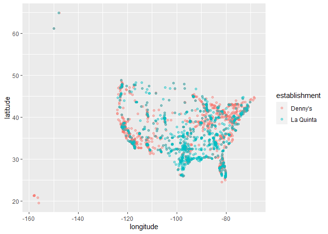
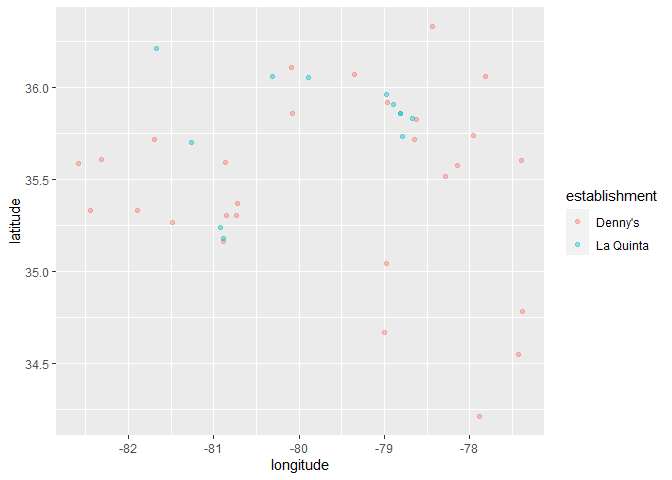
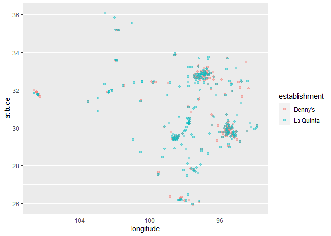

Lab 04 - La Quinta is Spanish for next to Dennys, Pt. 1
================
Ryan Wheat
Insert date here

### Load packages and data

``` r
library(tidyverse) 
library(dsbox) 
```

``` r
states <- read_csv("data/states.csv")
dennys <- dennys
laquinta <- laquinta
```

### Exercise 1

There are 1,643 rows, each representing one Denny’s location. There are
6 columns, each representing one piece of info about each respective
location: address, city, state, zip, longitude, lattitude.

``` r
#number of rows n columns

nrow(dennys)
```

    ## [1] 1643

``` r
ncol(dennys)
```

    ## [1] 6

``` r
#glimpse of rows n columns

glimpse(dennys)
```

    ## Rows: 1,643
    ## Columns: 6
    ## $ address   <chr> "2900 Denali", "3850 Debarr Road", "1929 Airport Way", "230 …
    ## $ city      <chr> "Anchorage", "Anchorage", "Fairbanks", "Auburn", "Birmingham…
    ## $ state     <chr> "AK", "AK", "AK", "AL", "AL", "AL", "AL", "AL", "AL", "AL", …
    ## $ zip       <chr> "99503", "99508", "99701", "36849", "35207", "35294", "35056…
    ## $ longitude <dbl> -149.8767, -149.8090, -147.7600, -85.4681, -86.8317, -86.803…
    ## $ latitude  <dbl> 61.1953, 61.2097, 64.8366, 32.6033, 33.5615, 33.5007, 34.206…

``` r
summary(dennys)
```

    ##    address              city              state               zip           
    ##  Length:1643        Length:1643        Length:1643        Length:1643       
    ##  Class :character   Class :character   Class :character   Class :character  
    ##  Mode  :character   Mode  :character   Mode  :character   Mode  :character  
    ##                                                                             
    ##                                                                             
    ##                                                                             
    ##    longitude          latitude    
    ##  Min.   :-158.09   Min.   :19.65  
    ##  1st Qu.:-117.33   1st Qu.:33.00  
    ##  Median : -96.84   Median :36.05  
    ##  Mean   : -99.60   Mean   :36.36  
    ##  3rd Qu.: -82.65   3rd Qu.:40.09  
    ##  Max.   : -68.42   Max.   :64.84

### Exercise 2

There are 909 rows, each representing one La Quinta hotel location.
There are, again, 6 columns, each of which represent one variable for
each location: address, city, state, zip, longitude, lattitude. This is
the same dataframe structure as the Denny’s dataset.

``` r
#number of rows n columns

nrow(laquinta)
```

    ## [1] 909

``` r
ncol(laquinta)
```

    ## [1] 6

``` r
#what are the variables

glimpse(laquinta)
```

    ## Rows: 909
    ## Columns: 6
    ## $ address   <chr> "793 W. Bel Air Avenue", "3018 CatClaw Dr", "3501 West Lake …
    ## $ city      <chr> "\nAberdeen", "\nAbilene", "\nAbilene", "\nAcworth", "\nAda"…
    ## $ state     <chr> "MD", "TX", "TX", "GA", "OK", "TX", "AG", "TX", "NM", "NM", …
    ## $ zip       <chr> "21001", "79606", "79601", "30102", "74820", "75254", "20345…
    ## $ longitude <dbl> -76.18846, -99.77877, -99.72269, -84.65609, -96.63652, -96.8…
    ## $ latitude  <dbl> 39.52322, 32.41349, 32.49136, 34.08204, 34.78180, 32.95164, …

``` r
summarise(laquinta)
```

    ## # A tibble: 1 × 0

### Exercise 3

There are no Denny’s locations outside the U.S.A. There are 2,295 La
Quinta locations in other countries. They are in the following places:
Africa, Asia, Australia/Pacific Rim, Carribean, Central America, Europe,
Middle East, South America.

### Exercise 4

You could tell whether locations in the La Quinta dataframe are outside
the U.S. by filtering based on the state column.

### Exercise 5

There are no Dennys locations outside of the U.S.A.! Woo!

``` r
#filtering out Denny's locations that are outside the U.S.

dennys %>%
  filter(!(state %in% states$abbreviation))
```

    ## # A tibble: 0 × 6
    ## # … with 6 variables: address <chr>, city <chr>, state <chr>, zip <chr>,
    ## #   longitude <dbl>, latitude <dbl>

### Exercise 6

…

``` r
#creating new variable "Country" for Dennys locations

dennys <- dennys %>%
  mutate(country = "United States")
```

### Exercise 7

There are La Quinta locations outside of America in Canada, China,
Mexico, New Zealand, Turkey, UAE, Chile, & Colombia.

### Exercise 8

``` r
#Creating new variable "Country" for La Quinta locations. Note that the countries do not match what is on the La Quinta website (where I got the previous info...)

laquinta <- laquinta %>%
  mutate(country = case_when(
    state %in% states$abbreviation ~ "United States",
    state %in% c("ON", "BC") ~ "Canada",
    state == "ANT"           ~ "Colombia",
    state %in% c("QR", "AG", "CH", "NL", "VE", "PU", "SL") ~ "Mexico",
    state ==  "FM" ~ "Honduras"))

#filtering La Quinta locations for only those in U.S.A.

laquinta <- laquinta %>%
  filter(country == "United States")
```

### Exercise 9

California has 403 Dennys restaurants (the most) and Delaware has 1
Dennys restaurant (the least). This tracks for me.

La Quinta has 237 Texas locations (the most) and Maine has 1 location
(the least). It’s interesting that California doesn’t have anywhere
close to the number of La Quintas as Texas.

``` r
dennys %>%
  count(state) %>%
  inner_join(states, by = c("state" = "abbreviation"))
```

    ## # A tibble: 51 × 4
    ##    state     n name                     area
    ##    <chr> <int> <chr>                   <dbl>
    ##  1 AK        3 Alaska               665384. 
    ##  2 AL        7 Alabama               52420. 
    ##  3 AR        9 Arkansas              53179. 
    ##  4 AZ       83 Arizona              113990. 
    ##  5 CA      403 California           163695. 
    ##  6 CO       29 Colorado             104094. 
    ##  7 CT       12 Connecticut            5543. 
    ##  8 DC        2 District of Columbia     68.3
    ##  9 DE        1 Delaware               2489. 
    ## 10 FL      140 Florida               65758. 
    ## # … with 41 more rows

``` r
laquinta %>%
  count(state) %>%
  inner_join(states, by = c("state" = "abbreviation"))
```

    ## # A tibble: 48 × 4
    ##    state     n name           area
    ##    <chr> <int> <chr>         <dbl>
    ##  1 AK        2 Alaska      665384.
    ##  2 AL       16 Alabama      52420.
    ##  3 AR       13 Arkansas     53179.
    ##  4 AZ       18 Arizona     113990.
    ##  5 CA       56 California  163695.
    ##  6 CO       27 Colorado    104094.
    ##  7 CT        6 Connecticut   5543.
    ##  8 FL       74 Florida      65758.
    ##  9 GA       41 Georgia      59425.
    ## 10 IA        4 Iowa         56273.
    ## # … with 38 more rows

### Exercise 10

Seems like Dennys are concentrated in the Northeast and California,
while La Quintas are concentrated in the South/Southeast.

``` r
#create new variable for hotel vs. restaurant

dennys <- dennys %>%
  mutate(establishment = "Denny's")
laquinta <- laquinta %>%
  mutate(establishment = "La Quinta")

#merge into new dataset?

dn_lq <- bind_rows(dennys, laquinta)

#plot locations

ggplot(dn_lq, mapping = aes(x = longitude,
                            y = latitude,
                            color = establishment)) +
  geom_point(alpha = .4)
```

<!-- -->

### Exercise 11

It does seem like La Quintas tend to be next to Dennys, but Dennys don’t
necessarily tend to be next to La Quintas.

``` r
#filter for locations in NC

northc <- dn_lq %>%
  filter(state == "NC")

ggplot(northc, mapping = aes(x = longitude,
                            y = latitude,
                            color = establishment)) +
  geom_point(alpha = .4)
```

<!-- -->

### Exercise 12

This time, it seems like the reverse: Dennys are around La Quintas, but
La Quintas aren’t always around Dennys.

``` r
tx <- dn_lq %>%
  filter(state == "TX")

ggplot(tx, mapping = aes(x = longitude,
                            y = latitude,
                            color = establishment)) +
  geom_point(alpha = .4)
```

<!-- -->
